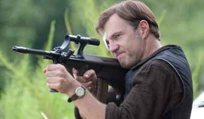

# suave!DOCYTPE HTML>

<html lang="pt-br">

<head>
		
<meta charset="utf-8">
<meta name="caio" content="teste">
<title>the walking dead</title>

</head>

<body>	
Ir para o paragrafo 2</a> 
<a href="#paragrafo5">Ir para o paragrafo 5</a> 
<a href="#atores">ir para atores</a> 
<a href="#ARMAS UTILIZADAS">ir para armas utilizadas na série</a> 
 
		
<marquee>the walking dead</marquee>
  

<h1>A história de The Walking Dead</h1> 

<h2>Como foi criada a série The Walking Dead</h2>

The Walking Dead é uma série de televisão dramática e pós-apocalíptica norte-americana, desenvolvida por Frank Darabont, e baseada na série em quadrinhos de mesmo nome de Robert Kirkman, Tony Moore e Charlie Adlard.[3] A série é exibida pelo canal AMC e é protagonizada por Andrew Lincoln[4] como o vice-xerife Rick Grimes da primeira à nona temporada.[5][6] Após a saída de Lincoln para se dedicar mais a sua família, a série passou a ser protagonizada pelos veteranos de elenco, Norman Reedus e Melissa McBride.[7] Outros membros do elenco de longa data incluem Steven Yeun, Chandler Riggs, Lauren Cohan, Danai Gurira, Josh McDermitt, Christian Serratos, Seth Gilliam e Ross Marquand.
  

A série é transmitida exclusivamente pela AMC nos Estados Unidos e internacionalmente por meio do Fox Networks Group. A série estreou em 31 de outubro de 2010.[8] The Walking Dead é produzido pela AMC Studios dentro do estado da Geórgia, com a maioria das filmagens ocorrendo nos grandes espaços ao ar livre do Riverwood Studios perto de Senoia, Geórgia.[9] A série foi adaptada dos quadrinhos por Frank Darabont, que também atuou como showrunner na primeira temporada. No entanto, conflitos entre Darabont e AMC forçaram sua saída da série.<b>Seguindo Darabont, Glen Mazzara, Scott M. Gimple e Angela Kang serviram como showrunners.</b>[10]A série tem sido bem aclamada e recebeu muitas indicações a prêmios, incluindo para o Writers Guild of America Awards[11][12][13] e o Golden Globe Awards na categoria melhor série dramática.[14] A série também atingiu fortes avaliações, de acordo com Nielsen Ratings, superando vários registros de séries de canal a cabo, incluindo o registo de 12.42 milhões de espectadores no último episódio da sua terceira temporada.[15] A estreia da quinta temporada também bateu recordes, incluindo o de episódio de drama mais assistido da história da televisão a cabo, com 17.29 milhões de telespectadores.
 

<h2>video the walking dead</h2>

<iframe width="798" height="449" src="https://www.youtube.com/embed/cR0xGkAMzlg" frameborder="0" allow="accelerometer; autoplay; clipboard-write; encrypted-media; gyroscope; picture-in-picture" allowfullscreen></iframe>

<h2>Criticas</h2>

A série tem sido bem aclamada e recebeu muitas indicações a prêmios, incluindo para o Writers Guild of America Awards[11][12][13] e o Golden Globe Awards na categoria melhor série dramática.[14] A série também atingiu fortes avaliações, de acordo com Nielsen Ratings, superando vários registros de séries de canal a cabo, incluindo o registo de 12.42 milhões de espectadores no último episódio da sua terceira temporada.[15] A estreia da quinta temporada também bateu recordes, incluindo o de episódio de drama mais assistido da história da televisão a cabo, com 17.29 milhões de telespectadores.
  

<h2>Séries derivadas</h2>

A AMC também desenvolveu outras mídias relacionadas a The Walking Dead; uma série spinoff chamada Fear the Walking Dead estreou em 23 de agosto de 2015, e atualmente está em sua sexta temporada.[18] Um segundo spinoff, The Walking Dead: World Beyond, estreou em 4 de outubro de 2020.[19] A AMC anunciou planos para produzir três filmes que exploram a história de Rick após a saída de Lincoln. Em 2020, dois novos derivados foram anunciados: um focado nos personagens de Reedus e McBride e uma série de antologias com histórias de fundo de personagens individuais.  

<b>Robert Kirkman e Tony Moore são os criadores dos quadrinhos de sucesso The Walking Dead</b> que viriam a ser adaptados em uma das séries mais populares de sempre.A história se foca em Rick Grimes, que acorda de um coma apenas para descobrir que o mundo foi devastado pelo apocalipse zumbi. Rick tem então como objetivo procurar seu filho e esposa e tentar sobreviver no novo mundo.
Mas a beleza de The Walking Dead e o que a destaca de outras histórias do gênero zumbi é o fato de se focar nas relações entre os sobreviventes mais do que no terror dos monstros que os ameaçam. Embora seja uma franquia que não tem medo de chocar o público com temas sensíveis e acontecimentos brutais, o drama interior dos personagens continua sendo algo fulcral, lembrando todo mundo de que por vezes os vivos são mais perigosos que os mortos.
  

  <h1>atores</h1>
  
  
  
 <h2>Andrew Lincoln (Rick Grimes)</h2>
 
 
Lincoln viveu o personagem que foi o rosto e a estrela de The Walking Dead durante muito tempo: Rick Grimes. O xerife de King County foi um dos líderes do grupo, sendo da 1ª temporada até a 9ª temporada, quando se despediu da série no episódio What Comes After. Lincoln deve retornar ao papel de Grimes para um longa-metragem que está sendo planejado.
  

 <h2>Jon Bernthal (Shane Walsh)</h2>
 
 
O ator foi responsável pelo papel de Shane Walsh, o braço direito e melhor amigo de Rick Grimes no mundo pré-apocalíptico. Após a chegada dos zumbis, a relação entre os dois só se desgasta e, na 2ª season, ele acaba se tornando o principal antagonista da série. Shane morre tentando emboscar Rick para se tornar o líder do grupo. Atualmente, Bernthal foi o protagonista da série The Punisher, na Netflix.

  
 <h2>Norman Reedus (Daryl Dixon)</h2>
 
 
Daryl Dixon, interpretado por Norman Reedus, fez o caminho inverso de Shane Walsh. Apresentado como alguém brutal e nada confiável, o personagem se desenvolveu e chegou a dividir com Rick o protagonismo da série. Após a saída do xerife, Daryl se tornou o principal rosto de The Walking Dead, aparecendo em todos os produtos da série. O sucesso é tanto que ele já está marcado para participar do spin-off Daryl & Carol, que deve começar a ser produzido após o fim de TWD, em 2023.

  
 <h2>Laurie Holden (Andrea)</h2>
 
 
Holden interpretou a carismática Andrea, que teve um dos finais mais emocionantes da série. Na 3ª season, após descobrir que havia sido mordida por um zumbi, Andrea decide tirar a própria vida para não se tornar um ser monstruoso. Após fazer parte do elenco de The Walking Dead, Holen participou das séries The Americans e Proven Innocent.

  
 <h2>Steven Yeun (Glenn Rhee)</h2>
 
 
Glenn Rhee foi um marco na série. O personagem interpretado por Yeun fez parte de um dos casais mais românticos da série e também sofreu a morte mais impactante do seriado — quando Negan assassina Rhee de forma extremamente violenta na frente de todo o grupo. Hoje em dia, Yeun empresta a voz para Speckle na animação Tuca & Bertie.

 
 <h2>Chandler Riggs (Carl Grimes)</h2>
 
 
Um dos personagens em que é mais perceptível a passagem do tempo é Carl Grimes, que foi interpretado por Chandler Riggs. O ator entrou para o elenco de The Walking Dead com apenas 10 anos, ou seja, ele cresceu nos estúdios da AMC. Infelizmente, Carl morre na 8ª temporada da série após ser mordido por um zumbi. Atualmente, Riggs é um personagem recorrente em A Million Little Things.

  
 <h2>Jeffrey DeMunn (Dale Horvath)</h2>
 
 
Jeffrey era um dos atores mais velhos no elenco de The Walking Dead e fez o papel de Dale Horvath, que era amado pelos fãs pelo seu bom coração e forte moral. Ainda assim, Dale morreu no meio da 2ª temporada atacado aleatoriamente por um zumbi. Atualmente, DeMunn está no seriado americano Billions. 

  
  
 <h1>Armas utilizadas na série</h1>
 <h2>AK-47</h2>
 
 
 <h2>AR-15</h2>
 
 
 <h2>AUG</h2>
 
 
 <h2>COLT PHITON</h2>
   

<a href="#inicio">Ir para o inicio</a>
		 
</body>
		 
 </html>
 
